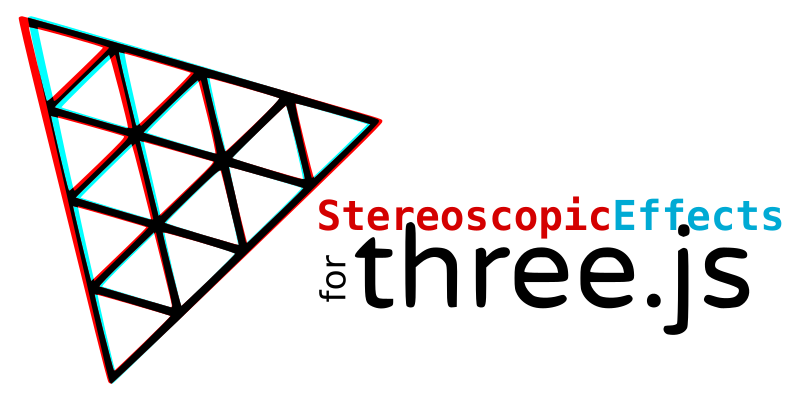

StereoscopicEffects for three.js
================================

This module provides effects to display a 3D scene created with threeJS in **stereoscopy** (multiple methods)

What does it mean?
------------------

Displaying 3D scenes with threeJS is very nice, but displaying them so that the users can view them with depth is even better.
As humans, we have a strong depth perception based on the slight differences of parallax perceived by our eyes.
In threeJS, the StereoCamera allows to mimic the perception of each eye independantly, but the rest of the work is up to the develpper.

Furthermore, there exist tens of methods to display stereoscopic content.
Each one has its pro and cons, and displaying one or another depends on which apparatus the user uses or prefers.
The best is thus to let the users choose their display mode.

This module allows to display in a lot of methods easily.

Which methods are supported?
----------------------------

- Side-by-Side
    * Parallel view
    * Cross view
    * Parallel anamorphic view
    * Cross anamorphic view
- Top-and-Bottom
    * Top-Bottom view
    * Bottom-top view
    * Top-Bottom anamorphic view
    * Bottom-top anamorphic view
- Interleaved
    * Interleaved lines 1
    * Interleaved lines 2
    * Interleaved columns 1
    * Interleaved columns 2
    * Checkerboard 1
    * Checkerboard 2
- Single view
    * Single view left
    * Single view right
- Anaglyph
    * Anaglyph Red/Cyan Gray
    * Anaglyph Red/Cyan Half Colors
    * Anaglyph Red/Cyan Dubois
    * Anaglyph Yellow/Blue Gray
    * Anaglyph Yellow/Blue Half Colors
    * Anaglyph Yellow/Blue Dubois
    * Anaglyph Green/Magenta Gray
    * Anaglyph Green/Magenta Half Colors
    * Anaglyph Green/Magenta Dubois

And the module renders also the WebXR session if started.
